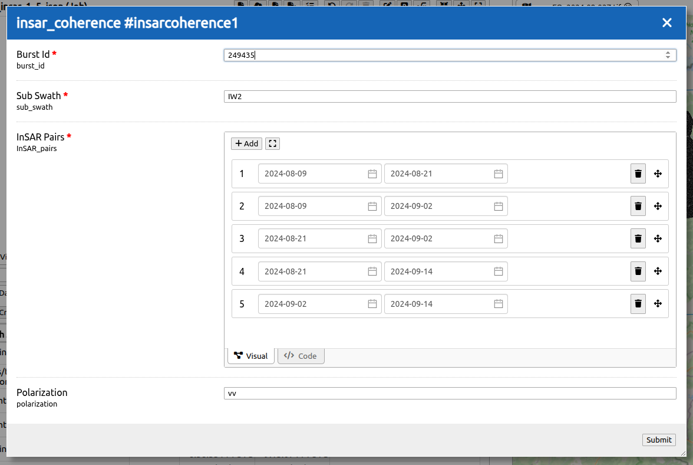

## How to run coherence and preprocessing in OpenEO

Example of a process graph to run coherence:

The parameters used in the insar_coherence node are shown here:


Preprocessing without coherence can be done with a different node. The result is a stack of coregistered SLC in SAR geometry, therefore it cannot be geo-referred on a map. A sample result is shown including the amplitude image derived from the real and imaginary part of the SLC:


the latitude raster:


the longitude raster:


## How is insar integrated in openEO

- The Python notebooks from Eurac where converted to plain Python scripts that output a STAC collection.
- Those scripts are embedded in a docker image.
- Those docker images are referred to in `.cwl` files
- The insar_coherence and insar_preprocessing openEO processes will call those files on Calrissian, and the output STAC
  catalog will be written into an S3 bucket.

The following image showcases the architecture of the OpenEO InSAR process:


## How to access:

Follow the instructions here to make an account: https://documentation.dataspace.copernicus.eu/Registration.html

### Run preprocessing in OpenEO:

```python
import openeo

url = "https://openeo.dataspace.copernicus.eu"
connection = openeo.connect(url).authenticate_oidc()

datacube = connection.datacube_from_process(
    process_id="insar_preprocessing_v02",
    master_date= "2024-08-09",
    temporal_extent= [
      "2024-08-09",
      "2024-09-02"
    ],
    burst_id=249435,
    sub_swath="IW2",
    polarization="vv"
)

job = datacube.create_job(job_options={  # TODO: Use less memory
    "driver-memory": "7G",
    "driver-memoryOverhead": "5G",
    "executor-memory": "5G",
    "executor-memoryOverhead": "5G",
    "python-memory": "4200m",
})
job.start_and_wait()
job.get_results().download_files()
```

### Run interferogram + coherence in OpenEO:

```python
import openeo

url = "https://openeo.dataspace.copernicus.eu"
connection = openeo.connect(url).authenticate_oidc()

datacube = connection.datacube_from_process(
    process_id="insar_coherence",
    InSAR_pairs=[["2024-08-09", "2024-09-02"], ["2024-08-21", "2024-09-02"]],
    burst_id=249435,
    coherence_window_az=2,
    coherence_window_rg=10,
    n_az_looks=1,
    n_rg_looks=4,
    polarization="vv",
    sub_swath="IW2",
)

job = datacube.create_job()
job.start_and_wait()
job.get_results().download_files()
```
